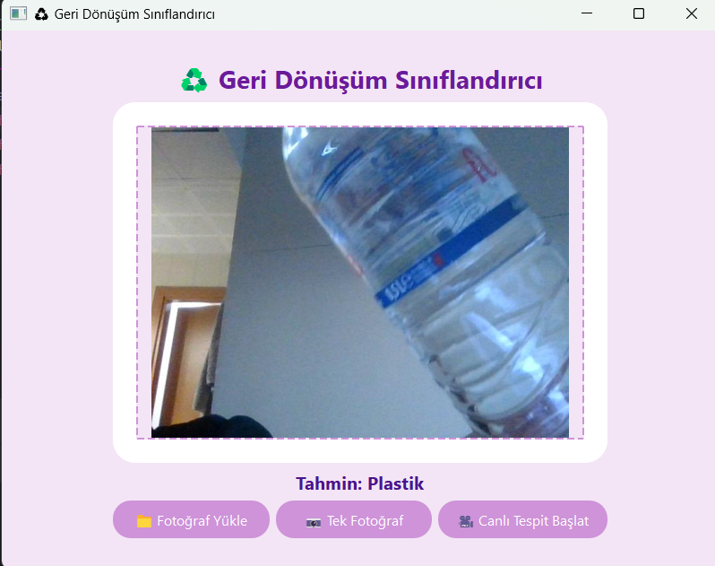

# ♻  Geri Dönüşüm Sınıflandırıcı

Kamera veya fotoğraf üzerinden **çöp sınıflandırması** yapan şık bir PyQt5 masaüstü uygulaması.  
Derin öğrenme tabanlı **ResNet18** modeli ile 12 farklı atık türünü gerçek zamanlı olarak tanır.

---

## ✨ Özellikler
- 📁 **Fotoğraf Yükle**: Bilgisayardan tek bir resim seçip sınıflandır.
- 📷 **Tek Fotoğraf Çek**: Anlık kamera görüntüsü alıp tahmin yap.
- 🎥 **Canlı Tespit**: Kameradan akan görüntüyü sürekli işleyip anlık tahmin gösterir.
- 🌸 **Modern Arayüz**: Pastel tonlarda, hover efektli, kullanıcı dostu PyQt5 arayüzü.

---

## 🗂️ Sınıflar
Model şu 12 kategoride tahmin yapar:

`Batarya, Biyolojik, Kahverengi-Cam, Karton, Kıyafet,
Yeşil-Cam, Metal, Kağıt, Plastik, Ayakkabı, Çöp, Beyaz-Cam`
---

---
